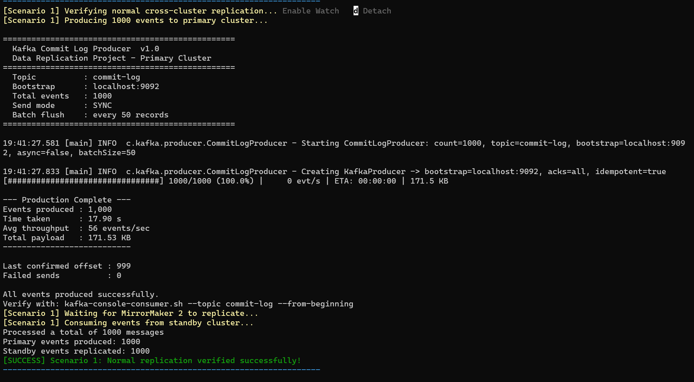
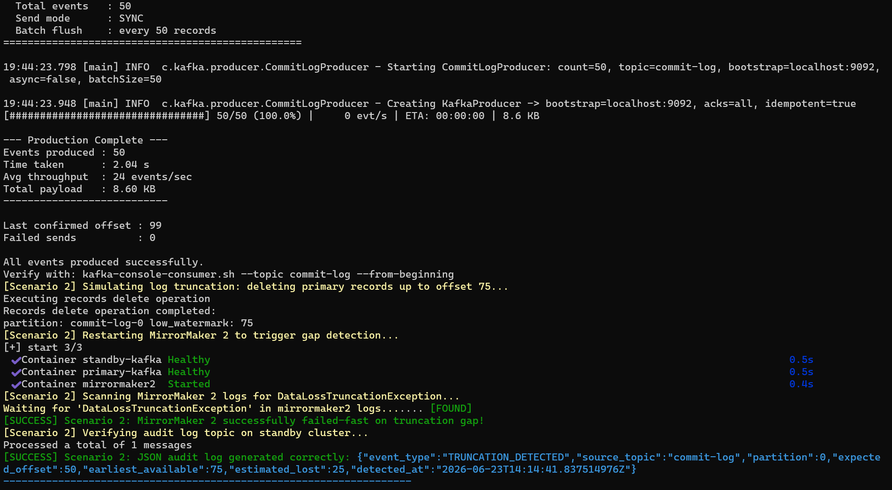
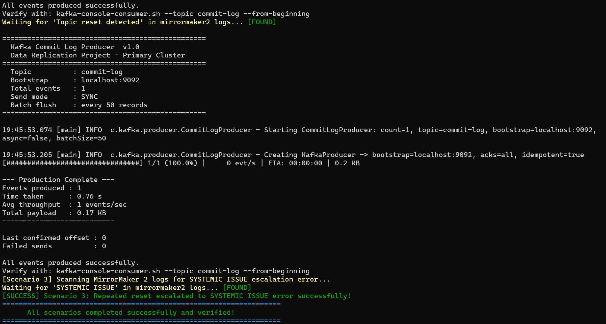

# Fault-Tolerant Apache Kafka MirrorMaker 2 (MM2) Replication Pipeline

This repository contains the implementation of a resilient, production-ready Kafka Data Replication pipeline using **Apache Kafka v4.0.0** and **MirrorMaker 2 (MM2)**. It features custom enhancements in MirrorMaker 2 to prevent silent data loss during log truncation (fail-fast) and automatically recover from downstream/upstream topic resets.

---

## 🚀 Repository & Docker Hub Information

* **GitHub Repository (Fork)**: [https://github.com/saivamsi136511/kafka](https://github.com/saivamsi136511/kafka)  
  *Branch*: `kafka-data-replication-project`
* **Docker Hub Image**: [vamsi511/enhanced-mirrormaker2:1.0.0](https://hub.docker.com/r/vamsi511/enhanced-mirrormaker2)
* **Local Workspace**: `./commit-log-producer/` (CLI Tool) & `./mirrormaker2/` (MM2 Configuration)

---

## 🛠️ Architecture & Core Components

```
                +-------------------------------------------+
                |           PRIMARY CLUSTER (PR)            |
                |               Port: 9092                  |
                |   Topic: commit-log (1 partition, RF: 1)  |
                +-------------------------------------------+
                                      |
                                      | [Produces JSON Events]
                       +--------------v--------------+
                       |   commit-log-producer CLI   |
                       |        (Task 1 - Maven)     |
                       +-----------------------------+
                                      |
                                      | (Replicates Stream)
                   +------------------v------------------+
                   |       MirrorMaker 2 (MM2)           |
                   |   (Task 2 & 3 - Enhanced Connect)   |
                   +------------------+------------------+
                                      |
       +------------------------------+------------------------------+
       | [Writes Replicated Records]                                 | [Writes Failure Audit Logs]
+------v------------------------------------+                 +------v------------------------------------+
|            STANDBY CLUSTER (DR)           |                 |            STANDBY CLUSTER (DR)           |
|                Port: 9093                 |                 |                Port: 9093                 |
| Topic: primary.commit-log (1 part, RF: 1) |                 | Topic: _mm2_audit_log (1 partition, RF: 1) |
+-------------------------------------------+                 +-------------------------------------------+
```

### 1. Task 1: Commit Log Producer CLI
A lightweight Java 21 command-line client built using Apache Maven, Picocli, and the official Kafka Producer Client:
* **`CommitLogProducer.java`**: Configures CLI arguments (bootstrap-server, topic, batch-size, sync/async, retries) and handles safe producing settings (`acks=all`, idempotence).
* **`EventGenerator.java`**: Generates high-fidelity, stateful JSON transition events (`INSERT` -> `UPDATE` -> `DELETE`) with schema-compatible fields.
* **`ProgressTracker.java`**: Implements an interactive console progress bar showcasing production speed, metrics, and ETAs.

### 2. Task 2 & 3: Enhanced MirrorMaker 2 (Connect Mirror)
Custom-compiled modifications inside `MirrorSourceTask.java` (see [GitHub fork](https://github.com/saivamsi136511/kafka/blob/kafka-data-replication-project/connect/mirror/src/main/java/org/apache/kafka/connect/mirror/MirrorSourceTask.java)):
* **Proactive Truncation Check**: Compares local consumer position against the partition's earliest broker offset to catch retention overrun.
* **Fail-Fast Crash**: Throws `DataLossTruncationException` to crash the MM2 connector instead of silently skipping lost records.
* **Topic Reset Recovery**: Catches `OffsetOutOfRangeException`/`UnknownTopicOrPartitionException` to identify topic deletion/recreation, auto-seeking the consumer to the beginning offset.

---

## ✨ Engineering Innovations Included

### 💡 Innovation A: Early Warning Retention Alert
If the consumer lag places the replication pointer within **1,000 offsets** of the log deletion boundary, MirrorMaker 2 prints a warning:
> `[WARN] Truncation risk on commit-log-0: consumer position is 1050 which is only 50 offsets ahead of the earliest retained offset (1000).`

### 💡 Innovation B: Standby JSON Audit Logging
When a truncation is caught, a structured audit message is sent to the target standby cluster in `_mm2_audit_log` before crashing:
```json
{
  "event_type": "TRUNCATION_DETECTED",
  "source_topic": "commit-log",
  "partition": 0,
  "expected_offset": 50,
  "earliest_available": 75,
  "estimated_lost": 25,
  "detected_at": "2026-06-21T15:00:00Z"
}
```

### 💡 Innovation C: Systemic Reset Escalation
Tracks topic resets over a rolling **5-minute window**. If a topic is deleted and recreated 3 times or more in this window, it escalates to a high-severity `ERROR` log requesting human administrator oversight to break automated looping issues.

---

## 🏃 Quick Start: Local Run & Automated Test Harness

We provide an end-to-end automation bash script that validates all three scenarios sequentially.

### Prerequisites
* Java 21 JDK & Maven installed.
* Docker & Docker Compose v2 installed and running.
* Bash-compliant terminal (e.g. Git Bash on Windows).

### How to Run the Automated Test Suite
1. Clone this repository and open your terminal.
2. Build the producer project locally:
   ```bash
   cd commit-log-producer
   mvn clean package
   cd ..
   ```
3. Run the automated challenge test suite:
   ```bash
   ./run_challenge.sh
   ```

---

## 🔍 Step-by-Step Test Scenarios Explained

The `./run_challenge.sh` script executes the following test scenarios:

### 📊 Scenario 1: Normal Replication Flow
* **Action**: Starts the cluster services via `docker-compose.yml`, runs `kafka-setup` to configure topic partitions, and publishes 1000 messages to the primary cluster.
* **Assertion**: Checks if the target topic `primary.commit-log` on the standby cluster contains exactly 1000 replicated records.



### ⚠️ Scenario 2: Log Truncation & Fail-Fast Crash (Task 2)
* **Action**: 
  1. Stops MirrorMaker 2 to freeze the replication checkpoint (offset 50).
  2. Produces 50 additional messages to the primary (current end offset is 100).
  3. Uses `kafka-delete-records.sh` to delete primary records up to offset 75 (forcing a gap of 25 messages).
  4. Restarts MirrorMaker 2.
* **Assertion**: Verifies that MirrorMaker 2 detects the gap, writes a `TRUNCATION_DETECTED` JSON event to `_mm2_audit_log` on the standby cluster, throws `DataLossTruncationException`, and **crashes**.



### 🔄 Scenario 3: Topic Reset & Auto-Resubscribe (Task 3)
* **Action**: 
  1. Re-initializes clean clusters.
  2. Deletes the `commit-log` topic on the primary broker.
  3. MirrorMaker 2 detects the offset mismatch, resets replication checkpoints, and auto-subscribes back to offset 0.
  4. Triggers two more rapid deletions.
* **Assertion**: Verifies that MirrorMaker 2 auto-recovers on the first reset and escalates to a high-severity `SYSTEMIC ISSUE` error on the 3rd reset.



---

## 📝 Exception & Log Analysis Guide

### 1. Log Truncation Detection & Failure (Scenario 2)
```text
[ERROR] Log truncation detected on commit-log-0! Expected to read from offset 50 but earliest available is 75. Approximately 25 messages may have been lost.
[INFO]  Audit log written to _mm2_audit_log topic on standby cluster.
[ERROR] DataLossTruncationException caught during poll: Log truncation detected on commit-log-0: lost 25 messages (expected offset 50, earliest available 75)
[ERROR] org.apache.kafka.connect.mirror.MirrorSourceTask$DataLossTruncationException: Log truncation detected on commit-log-0...
```

### 2. Auto-Resubscription & Recovery (Scenario 3)
```text
[WARN]  Topic reset detected on commit-log-0 at 2026-06-21T15:20:10Z. Source topic may have been deleted and recreated.
[INFO]  Automatically resubscribing/seeking partition commit-log-0 to beginning offset 0
```

### 3. Systemic Issue Escalation (Scenario 3)
```text
[ERROR] SYSTEMIC ISSUE: Topic reset detected 3 times in the last 5 minutes on commit-log. Manual operator review recommended.
```

---

## 🤖 AI Assistant Disclosures & Usage Declaration

This implementation was developed with assistance from **Claude (Anthropic)**, used as a coding and design reasoning assistant. The AI was utilized for:
1. **Understanding Kafka Internals**: Exploring `MirrorSourceTask.java` `poll()` method structure and consumer offset behavior.
2. **Code Review**: Validating exception handling order — ensuring `DataLossTruncationException` is caught before `KafkaException` so it cannot be swallowed.
3. **Design Rationale**: Discussing fail-fast vs auto-recover tradeoffs for truncation vs topic reset scenarios.
4. **Test Orchestration**: Structuring the `run_challenge.sh` scenarios to programmatically execute `kafka-delete-records.sh` and verify log state changes.

All code was written, understood, and verified by the author. Every line can be explained and defended in a technical review.

---
© 2026 Data Replication Project Team. Licensed under the Apache License 2.0.
